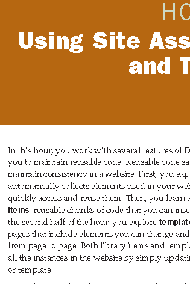

Smoothening fonts in Adobe Reader using the Accessibility Setup Assistant
============================================================================

Do your documents/designs seem to have fonts that are a bit rough around the edges when opened in Adobe Reader?  Do the downloaded PDFs and ebooks have odd font faces?  Are they difficult to read?

In an effort to improve user experience with ebooks, Adobe added an **Accessibility Setup Assistant** that previously popped up whenever a user opens a PDF in Adobe Reader.  The screenshot below is from an opened PDF ebook.  Note that the fonts have jagged edges and look like the wireframe previews in page layout programs.

To run the Setup Assistant to improve readability:

1. Click **Edit > Accessibility > Setup Assistant**.

2. Select the **Set all accessibility** option.  Click **Next**.

3. Ensure that **Disable text smoothing** is unchecked.

.. note::

	   Adobe Reader actually disables text smoothing when recommended settings are selected.

4. Click **Next > Next > Done**.

The following screen capture shows the improved text appearance.

.. figure:: images/reader_smoothen3.png
    :align: center

Users can opt for other PDF readers, particularly in **Linux**.  **Okular** and **Evince** in Linux display PDF without any font problems.  However, regardless of alternate applications, Adobe Reader is still an essential utility considering most professionals produce PDFs specifically to be displayed using this application.
