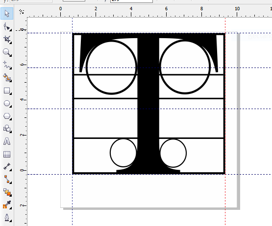
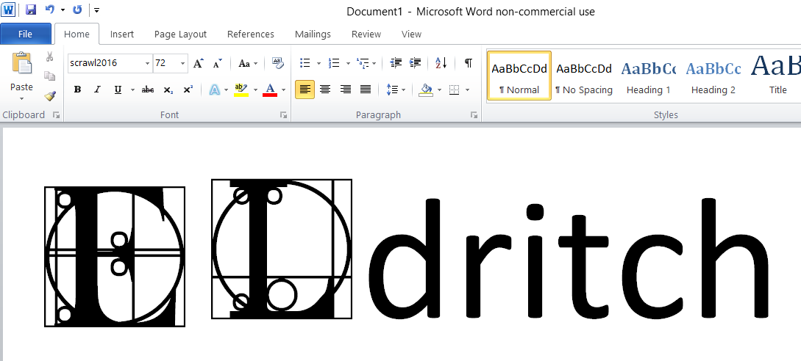
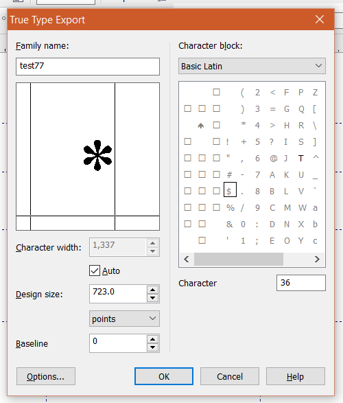

Creating a glyph for a font in CorelDraw X5
=====================================================

Prince, who recently passed away, was briefly referred to as a glyph for a few years. If you've ever wondered how the press and media were able to print his name, it's because the symbol was delivered and then converted to print manually.

The process for creating a glyph is the same as creating a character for a font set. Creating a full set of characters for a font is a lengthy process, but designing and exporting a single drawing to a font is straightforward. To make typing easier, a glyph is associated with a shortcut or associated to a specific key in a keyboard.

To create a glyph in **CorelDraw X5** and then export it to a font:

1. Design a vector image using the same characteristics as a font.

   Designers generally take note of the following properties:

   - Vertical and horizontal baseline value
   - Cap height
   - Descender length
   - Ascender height
   - Font size
   - Grid
   - Space Width
   - Leading

Most designers already have preset guidelines on their CorelDraw templates to ensure their character or glyph does not exceed a certain amount of space when typed. Today, creating a glyph is more flexible because screens have a higher resolution and text consumption is done on a screen or using a digital document (such as PDF or EPUB). The usage of the glyph, whether for web, print, or PDF, plays a part in the design. In general it's easier to check whether the glyph will look good in HTML, SVG, or PDF.

2. Once the design is complete, select all the vector objects and click **Arrange > Combine**. Depending on how you designed your glyph, you may need to use **Shaping tools** such as **Weld, Trim, Intersect,** and **Simplify** to make sure the design looks the way you intended. In short, the glyph needs to be a contiguous object without "holes".

3. Although you can certainly export the glyph later on as a standalone SVG, HTML5 object, or bitmap, if you're going to export it to a font file for easy distribution, convert the design to Black and White by clicking **Bitmap > Mode > Black and White**.

.. note::

	 This step is entirely optional since font file color support is limited. However, it's one way to check if there are any issues with the vector object.

4. To export the design to a font file, use the **Pick tool** to click the vector object, and then click **File > Export**. Select **TTF - True Type Font** as the file type and input a filename.

   Select the **Selected only** option, and then click **Export**.

   .. image:: images/ubo2022.PNG

5. Input a *Family name* for the font.  Mac OSX, Linux, and Windows will use this name to identify the font.

   Input the following values:

   - *Grid* - represents the general area occupied by the glyph.
   - *Leading (Interline)* - represents the space between lines of text.
   - *Space* - represents the width between other characters and the glyph.

   Click **OK**, and then **Yes** to save changes to the font file.

.. note::

	 As always, the output and usage of the glyph will determine what values you will input. If your target audience will be using a high-resolution device such as today's ultraportables (e.g. Dell XPS 13) or mid-range tablets (Samsung Galaxy Tab or iPad Mini), you can start with higher values and work downwards.

6. In the **True Type Export** window, adjust the **Character Width, Design size,** and **Baseline**. In the **Character Block** table, select the character set and any of the characters that you want users who will be receiving this font to press to use the symbol.

The **Baseline** is particularly important since it affects alignment with neighboring characters. The following screenshot shows how a lower **Baseline** changes the alignment of a glyph with *Calibre* text in **Microsoft Word 2010**. The resulting alignment will also appear when the Word document is exported to PDF.

6. Click **OK**.

7. If you want more than one customized glyph on the font, perform the same steps on the same TTF file. When you click **Export**, click **Yes** to replace the font file. Adjust the values in the **True Type Export** window as before, but select a different character from the character block.

.. note::

	Characters with an exported design will appear in slight bold. If you're creating a full set of font characters rather than 1 or 2 symbols/glyphs, you export roughly more than 80 characters.

8. Test the glyph by installing the TTF in Linux, Windows, and MacOSX and using the font in **Word, Pages,** and even in programs such as **Okular, Adobe Reader, Scribus** and **Inkscape**. If needed, export the glyph as SVG or HTML5 if you need to use the design in web pages. In addition, embed the glyph to an EPUB file or PDF document and view the glyph using smartphones, ereaders, and tablets with varying screen sizes.

.. note::

	 Take note that not all mobile apps will support embedded output.
