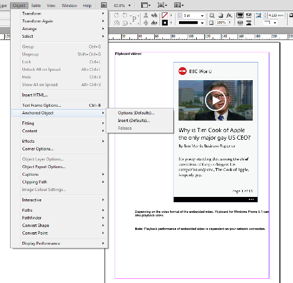
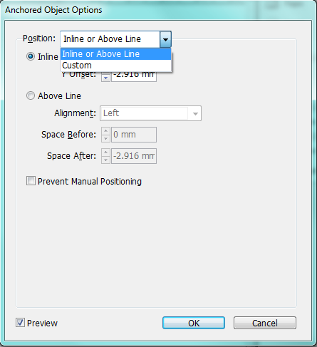
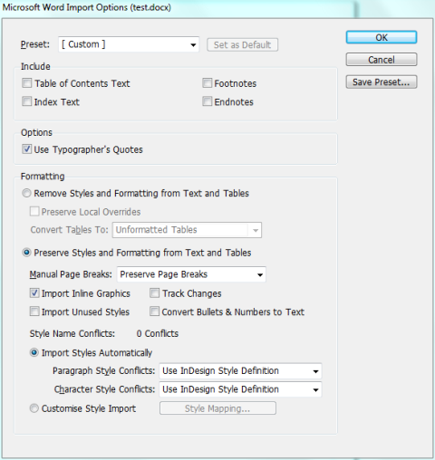

Releasing Anchored Objects in InDesign CS6
=============================================

When you Place a **Word 2007-2013** file in **Adobe InDesign CS6**, **InDesign** by default will import all inline images and anchor them to the text in one long text frame.

Although you can adjust the position of the inline image within its own frame, you won't be able to adjust the position of the frame itself completely unless you **Release the Anchored Object**. If the **Release** option is not available from the **Object > Anchored Object** menu, change the **Anchored Object** options to manual.

To change the options to manual and release the **Anchored Object**:

1. Using the **Selection Tool**, right-click on the inline image and click **Anchored Object > Options**.

2. Select **Custom** from the **Position list**. Click **OK**.

3. The **Release** option should now be available when you click **Object > Anchored Object > Release**.

Importing a Word document without inline images
----------------------------------------------------

Releasing an anchored object means you would have to adjust the text frames when positioning your image. If you have too many inline images in your imported **Word** document, you can prevent **InDesign** from importing all the inline images so you can **Place** them manually rather than releasing each one.

To import a **Word** document without inline images:

1. Click **File > Place**.

2. Select **Show Import** Options then select your **Word** document. Click **Open**.

3. In the **Microsoft Word Import Options** window, clear the **Import Inline Graphics** option.

