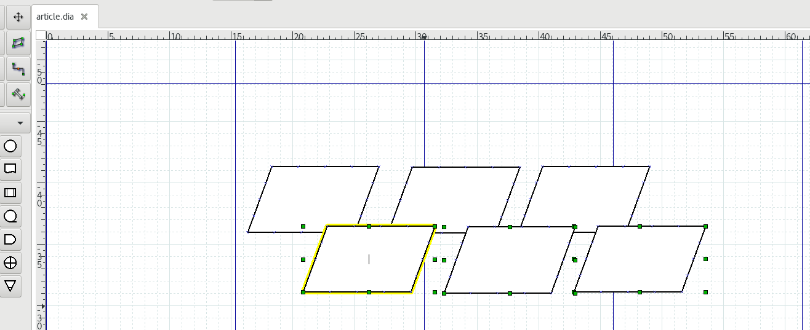
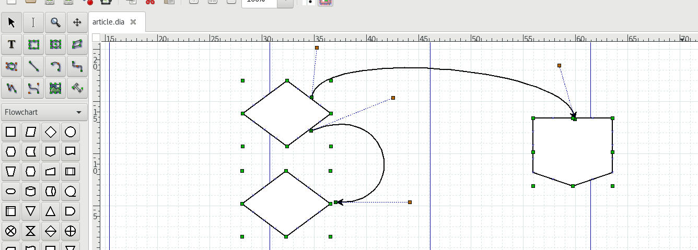
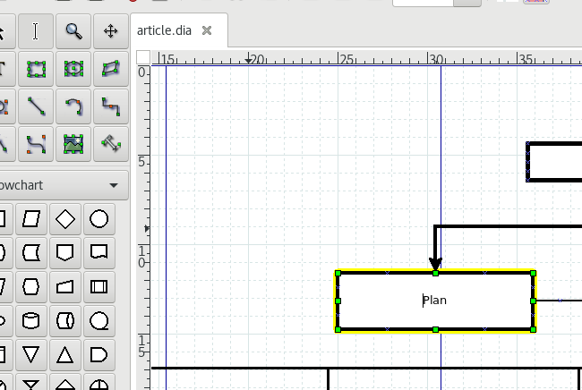
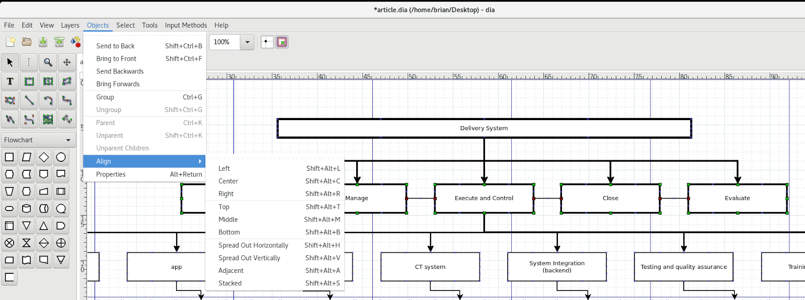
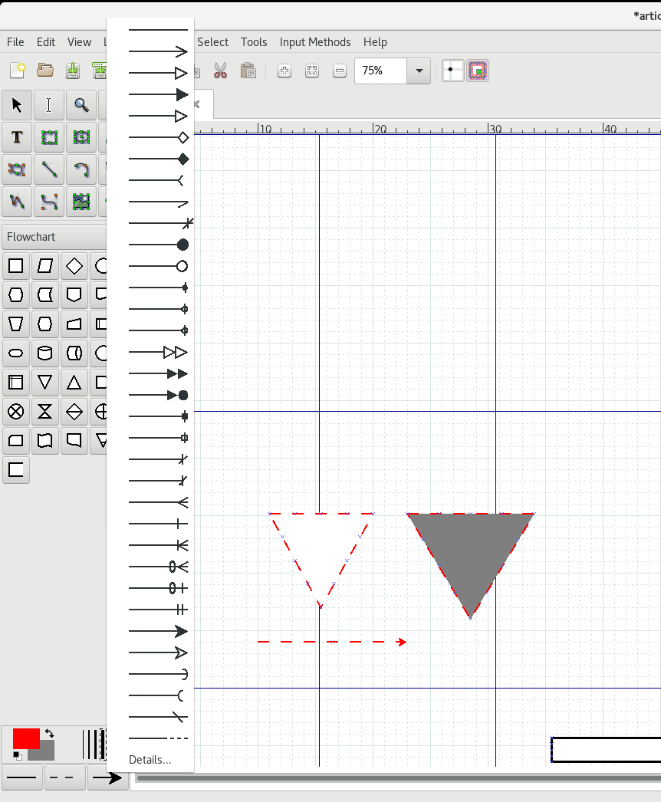

DIA Editor and Work Breakdown Structure (WBS) graphics
========================================================

The *Work Breakdown Structure* (WBS) is one method of providing a visual representation of project tasks. **PMBOK** and **Project Management** courses generally recommend the WBS as part of the planning stage of an information project. The WBS can be used as an early outline of minor and major tasks and phases of the project, and can be directly tied to the budgeting and time estimating phases of project planning.

You don't necessarily need **Microsoft Visio** to produce a usable and clean WBS. You can use any vector illustration program such as `CorelDraw <https://www.corel.com>`_ or **Adobe Illustrator**. If you're running Linux, you can use **Scribus** or **Inkscape**, which are both available from all mainstream Linux sofware repositories. If you prefer a dedicated application for producing a WBS quickly, you can use Dia Editor.

This article uses **Dia Editor 0.97.3** on **Fedora 25 Workstation**.

You can get started quickly with Dia Editor with very minimal setup. To make drawings on the **.dia** workspace, select a set of symbols and shapes from the main list (**Flowchart** or **UML** set for example), click a shape, and then click and drag on the drawing area to create a shape.

Some of the more useful tips when quickly creating a graphic for use with WBS are the following:

1. Click the **Pick** tool and select several shapes. Click **CTRL+D** to create duplicates of multiple shapes.

2. The **Bezier** tool is good for curved lines connecting objects, and gives you more control than the **Line, Arc,** and **Zigzagline** tool, because you can adjust the bezier angle. If you need to adjust the appearance or direction of a line created using the **Bezier** tool, just select the **Pick** tool, then click and drag the orange handles.

3. To quickly edit the text within a shape, click the **Text Edit** tool, and then click any drawn shape with text. In addition, if the last tool you selected was the **Text Edit** tool, you can press the **Space Bar** after drawing a shape to immediately enter text.

4. Even with the grid enabled from **View > Show Grid** and **View > Snap to Grid**, you still need to align and distribute objects horizontally and vertically. You can do this quickly by selecting objects using the **Pick** tool, then clicking **Objects > Align**.

5. You can quickly draw shapes with a specific thickness, fill color, or line, by modifying the color of the swatch, and then selecting a thickness from the lower-left corner. Options for adjusting the line start and end, and line appearance are also available.

6. You can directly save your graphic to **.png** by selecting the object and then clicking **File > Export**, and then inputting a filename with the **.png** extension. To ensure that all the objects of your graphic are saved as a PNG, zoom out and select all the objects. Group all of them by clicking **CTRL+G**. As an alternative, you can also click **Select > All (CTRL+A)** if you are sure you want all the objects exported.
