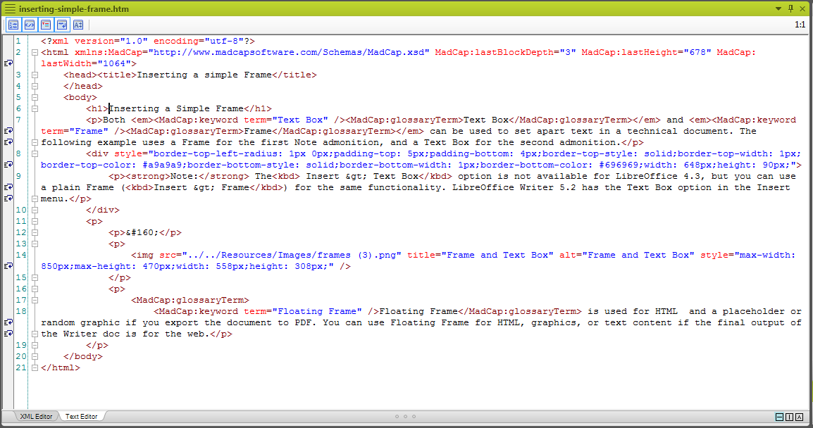
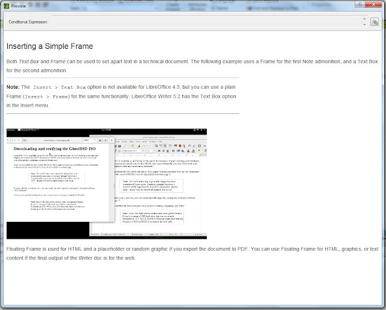

Creating DITA files from MadCap Flare 11
================================================================

**DITA** content is considered a "legacy" format in **MadCap** Flare and the **Help** file in Flare explicitly points out you can import DITA content to the application. However, there are limitations to editing the markup and associated styles. On the upside, Flare is excellent for transforming content to popular end user formats such as PDF and HTML5 and includes a truckload of preset styles, whereas back in the day, it was troublesome to convert from one format to the other without losing consistency using a tool chain. If your organization or company requires DITA files, there is a workaround for producing DITA files from existing content produced using Flare. Although it doesn't save you from editing the markup, it does cut down work time considerably compared with creating DITA files from scratch using a separate IDE or plain text editor.

This article applies to **MadCap Flare 11** with a basic workspace and presets. No customizations were made to Flare for the purpose of this article.

The following preset Flare styles and tags were used for the example in this article:

- ``glossary`` (for adding terms to the glossary)
- ``keyword`` (for adding text to the **Index**)
- ``kbd`` tag (for formatting user interface text)
- ``img`` (for adding images to the article)
- ``div`` style for a text box (for adding the **Note** admonition)

Setting up and previewing the **DITA** Target
------------------------------------------------

To create a DITA target output:

1. In the **Project Organizer**, right-click the **Targets** folder, and click **Add Target**.

2. Input a *filename* for the **Target**, and select *DITA* as the **Output Type**.

   For this example, the **DITA** target name is *dita-test*.

   .. image:: images/dita3.png

3. Click **Add**.

Once the DITA target is created, the target is available as a preview.

To preview the file using the DITA target, click the **Preview** icon, and then click the DITA target.

Compare the following two screenshots for the **PDF/HTML** and the DITA output.

The Flare DITA preview uses Flare styles.

.. image:: images/dita5.png

The Flare PDF output preview is almost similar in formatting except for issues with the text box border.

Apart from the added ``Glossary`` definition and an overly long text box border, there isn't much difference in formatting between the **PDF/HTML** output and the DITA output. Note, however, that the preview for a DITA target is misleading and only applies to publishing the DITA file from Flare.

If you're satisfied with how the DITA preview looks, you can build the DITA output for the whole project as you would with any Flare project.

On the **Project** ribbon, click **Build Primary**, and then select your DITA target.

Notes on the DITA output and markup
-----------------------------------------

Once the DITA target is built, open the output folder and navigate to the DITA target output folder to edit the DITA map. The DITA map is located in the parent folder of the target folder. DITA files have the standard **.dita** extension and you can open the .DITA files in your IDE or text editor of choice.

The DITA map, DITA glossary, and DITA topic files produced from Flare are pretty clean, and have significantly less markup compared with DITA output from **Adobe FrameMaker**. Moreover, the DITA files from the Flare target uses the **OASIS Public identifiers** for **DTDs**, which means validation in a DITA-compliant environment should have little to no issues.

Note that Flare automatically removes tags for for ``keyword``, ``kbd`` style, ``image``, and ``div`` and doesn't convert all the tags to **DITA**-compliant tags. The ``indexterm`` tag was an exception for this example, and was converted from ``MadCap:glossaryTerm``. Notably, markup for the screenshot is removed, which means if you decide to use the DITA export from Flare for your DITA projects in a different environment, you will have to manually add back references to images using a text editor or IDE.

