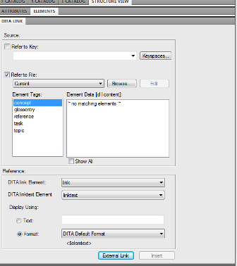
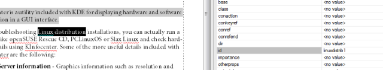
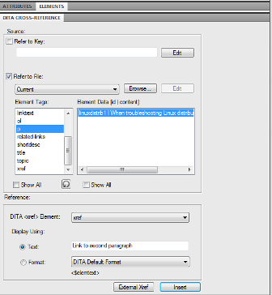
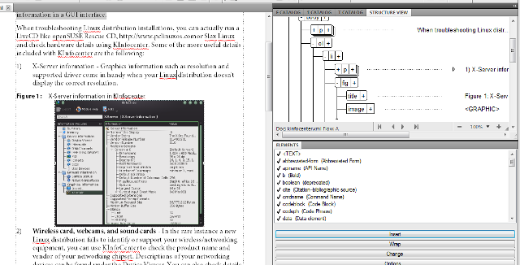
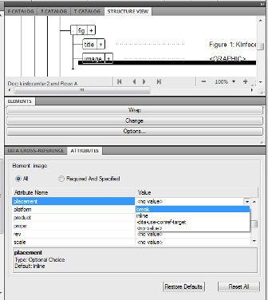
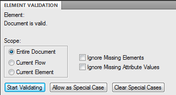
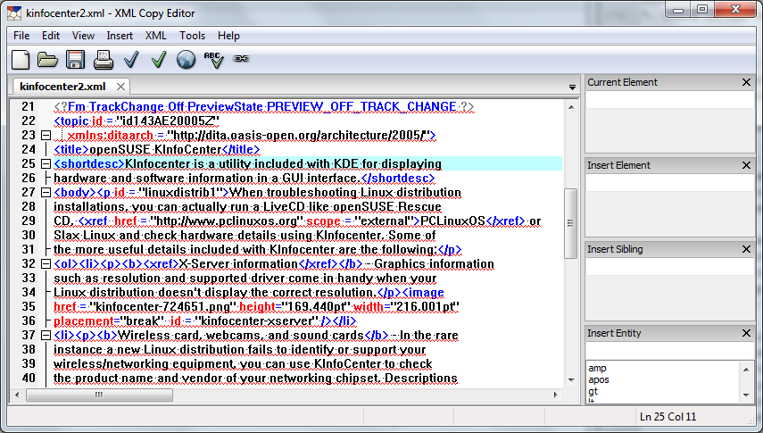

Getting started with a DITA topic in FrameMaker 10
====================================================

.. ..contents:: Table of Contents
	:depth: 3

Most of Adobe's products, such as **Photoshop** and **InDesign**, are intuitive and fairly easy to learn. **FrameMaker**, however, can be a challenge even to the most dedicated XML or Adobe enthusiast. Lynda.com has a fairly good overview of using FrameMaker for unstructured documents, but if you plan to start with structured FrameMaker and DITA then it's a good idea to try out the included DITA templates.

If you are just getting started with DITA then I recommend a really well written article by Hussein Shafie entitled `DITA for the Impatient <http://www.xmlmind.com/tutorials.html>`_.

To begin writing a DITA Topic in FrameMaker 10:

1. Click **File** then **New**. Select **DITA** then **New<topic>...**

2. Input a filename and click **Save**.

3. FrameMaker loads the **Structured Authoring** workspace and should display the **Structure View, Attributes,** and **Elements** panels.

.. note::

	One concept that can be difficult for those familiar with typical WYSIWYG applications is that for FrameMaker you work primarily on the **Structure View** panel for XML tags and the outline of the document and the document window for the readable text. For clarity, this tutorial will specify if the step will be done in the **Structure View** panel or the document window.

5. On the document window, select **TOPIC TITLE** and type your topic. Do not press the Return/Enter key after entering your title. To avoid confusion, avoid using the Return/Enter key when working in the **Structured Authoring** workspace.

6. We'll now insert a **Short Description**, an optional part of a **Topic** as recommended by DITA 1.2 Specifications. If you need a guide, you can download the DITA 1.2 Specifications as a PDF or CHM for Windows users. For the sake of brevity, this tutorial will only focus on using ``title, shortdesc, body, ordered list,`` and ``related links`` to structure the document.

7. On the **Structure View** panel, place your mouse pointer under title so an arrow is displayed. Click once for a structure insertion point (a 90 degree rotated triangle) to be displayed.

.. image:: images/f10-dita1.png

8. On the **Elements** panel, click ``shortdesc`` and then **Insert**.

9. On the document window, a text insertion point is now available. Enter your short description for your Topic.

If you are going to paste text from another source, use the **Paste Special** option under the **Edit** menu. Select **Text** (for plain text) to avoid any markup or encoding issues.

10. On the **Structure View** panel, place your mouse pointer under ``shortdesc`` so an arrow is displayed. Click once to produce a structure insertion point. Select ``body`` on the **Elements** panel and then click **Insert**.

.. image:: images/f10-dita2.png

11. On the document window, type or paste your short description.

12. On the **Structure View** panel, place your mouse pointer under ``p`` and click once to produce a structure insertion point. Select ``ol`` (Ordered List) and then **Insert**.

If you make a mistake and select the wrong **Element** from the list. Do not click **Undo** as you would with InDesign or Photoshop. Instead, select the **Element** from the **Structure View** panel, right-click, and then click **Clear**.

.. image:: images/f10-dita3.png

13. On the document window, type or paste your first list item.

14. To add additional list items to your list, just repeat the process in the **Structure View** panel but clicking underneath the ``li`` element. If you make a mistake or press the Return key or input the text/tag in the wrong place, just right-click on the item in **Structure View** and click **Clear**.

Don't worry about adding links, using other elements like ``bold`` and ``figure`` quite yet. Finish your main text first and you can add additional elements using the **Wrap** option later.

15. On the **Structure View** panel, click the ``-`` next to ``ol`` to collapse the list once you are finished to give you an abbreviated preview of your structure. We will now add the ``related links`` element to complete the article.

16. The related links deserve a special section of its own so click under the main hierarchy of topic. Do not click under ``body`` or ``ol`` in the **Structure View** panel.

FrameMaker will assist you by not displaying ``related-links`` on the Elements panel if you click under ``ol`` or ``body``.

Select ``related-links`` on the **Elements** panel and click **Insert**.

.. image:: images/f10-dita4.png

17. To add links, click ``link`` on the **Elements** panel. FrameMaker 10 will display the **DITA Link** panel.

18. For this tutorial, we'll add a simple External Link. In the DITA Link panel, click **External Link**.

19. In the **DITA External Link** window, fill out the **Link Target(href):** and **Link Text: items**. Click **OK**.

.. image:: images/f10-dita6.png

20. On the document window, the new external link will be added. To add a description, click under ``linktext`` in the **Structure View panel** and select ``desc`` (Description) on the **Elements** tab. Click **Insert**.

.. note::

	FrameMaker has a bad habit of persistently displaying the DITA Cross-Reference panel after you add links. Just close the panel and click on the Elements tab and Structure View tab to display them again and continue working.

21. To add more links, repeat the process by adding another link element under ``related-links``.

22. Click **File > Save** to save your document. By default, FrameMaker 10 saves the document as **.xml** but if you plan to use the document as part of a larger DITA-based project, rename the file with the file extension **.dita** from **File Explorer**.

Adding an external link
----------------------------

We previously added a list of external links under the ``relatedlink`` section. This time we will add a hyperlink to text within the second paragraph.

1. In the document window, select the text which will link to an external URL.

2. Select ``xref`` in the **Elements** list and then click **Wrap**.

3. If FrameMaker 10 has not displayed the **DITA Cross Reference** panel, click the tab and then click **External Xref**.

4. In the **Xref Target(href):** field, input the external URL. Input the **Link Text** to be displayed as needed.

5. Click **OK**.

Adding an internal link
-----------------------------

Although this short topic doesn't need an internal link, we'll add a link to the second paragraph. Internal links in the same XML document are similar to anchors linked to ``href`` in HTML5.

1. On the document window, select the target text that will serve as the anchor.

2. Click the **Attributes** tab to display **Attribute Names** and **Values**.

3. Click the **id Attribute Name**. Input a Value.

4. We will now add a link to the anchor on a separate paragraph. In the **Structure view** panel, click once under the ``ol`` tag.

5. On the **Elements** list, select ``p`` then **Insert**.

6. Select ``xref`` (Cross Reference/Link), then click **Insert**.

7. On the **DITA Cross-Reference** panel, select **Refer to File:** and then select your .xml file on the list or leave the item as Current.

8. Since the text with an **id** (anchor) was in a ``p`` tag, select ``p`` on the **Element Tags** list. The id is displayed on the **Element Data** list. Select the **id** from the list.

9. On the **Text:** item, input text to be displayed for linking to your id.

10. Click **Insert**. The text will be displayed on the document window and a link to the second paragraph will be accessible when the FrameMaker document is exported to PDF.

Using the b element on text
-------------------------------

The ``b`` (Bold) element is surprisingly still used quite frequently in FrameMaker documents despite being a presentation element rather than a semantic one. Check with your instructor or company style guide for the correct or more specific element to use in place of the ``b`` (Bold) element. Since you are working on a structured XML document, your guide or instructor will probably discourage using the Bold element.

.. note::

	The ``b`` element is added in this tutorial to demonstrate how an inline element will be displayed when added in a structured document and exported to PDF using FrameMaker 10.

1. On the document window, select text to be rendered as bold.

2. Select ``b`` (Bold) on the **Elements** list. Click **Wrap**.

The text will be displayed as bold on the document window and later on will appear as bold in the rendered PDF.

Adding a figure or an image
-----------------------------

You can use the ``image`` element to add a bitmap or use the ``figure`` element to add both a title and an image. For this tutorial, we'll add a figure under one of the items on the unordered list.

1. On the Structure view panel, click once under the p tag and select ``fig`` (figure) on the **Elements** list. Click **Insert**.

2. Select ``title`` on the **Elements** list. Click **Insert**.

3. On the document window, input your image title.

4. On the **Structure view** panel, click once under ``title``. Select ``image`` on the **Elements** list. Click **Insert**.

5. On the **Insert Element** window, click **Browse** to navigate to your image. Click **OK**.

By default, the window will only display available JPEGs. Change the **Files of type:** option if your image is a GIF, PNG, or BMP.

6. On the **Imported Graphic Scaling** window, select or specify the appropriate dpi. Click **Set**.

.. image:: images/f10-dita9.png

7. The image will be displayed on the document window. Select the image on the **Structure view** panel.

8. On the **Attributes** panel, change the placement attribute to break or inline.

For more information about attributes for the ``image`` element and how to adjust an image's appearance when exported to PDF, refer to the `DITA 1.2 specification <http://docs.oasis-open.org/dita/v1.2/spec/DITA1.2-spec.html>`_.

Verifying the document
-------------------------

When you are done adding links, figures, and text, it is recommended that the tags in the document are validated.

To validate your document:

1. Click **Element** then **Validate...**

2. In the **Element Validation** panel, select **Entire Document**.

3. Click **Start Validating**. Ideally, the panel should indicate that your **"Document is valid."**

Publishing to PDF
------------------

Even if your DITA file will eventually be part of a larger system of documents and references, it's still a good idea to produce a PDF from FrameMaker to check if the internal links work and how the document may look like in PDF form. Take note, however, that since this tutorial used the Adobe template for DITA topics, none of the formatting has been customized and uses Adobe's defaults.

To produce a PDF from your DITA topic:

1. Click **File** then **Save As PDF...**

2. Input a filename and click **Save**.

3. On the **PDF Job Options:** item, select **Standard**.

4. Click **Set**.

5. If your system has **Adobe Acrobat** installed, the output PDF will automatically be displayed.

6. Check the bookmarks that are automatically created.

7. Check if the external links you added are working.

Exporting to XML from FrameMaker 10
----------------------------------------

Many veteran XML writers criticize the XML produced from FrameMaker and some consider using a non-Adobe IDE or a plain text editor as a better option when working with DITA.
If you want to see the XML or work on your document using other methods, you can open your DITA file in editors such as **XML Copy Editor**, **Visual Studio**, or even a browser to check the text.

Since this tutorial used the DITA template FrameMaker provides, the file is saved as **.xml** so you can open them directly using another application. If you saved your document in FrameMaker's native file format (**.fm**), click **File** then **Save As XML...** to produce an XML file.
