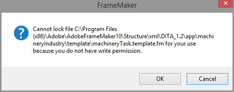
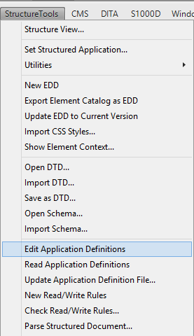
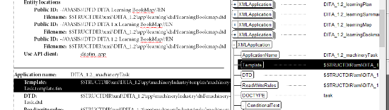
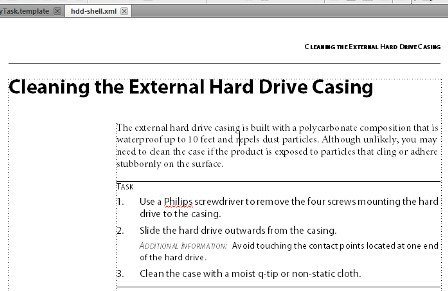

Modifying FrameMaker 10 structure templates in Windows 8.1
==============================================================

If part of your work in **Adobe FrameMaker 10** involves modifying the template of a structured app, then you might encounter a permissions error message in **Windows 8/8.1** indicating you do not have access to the template/file.

In this article, we'll take a look at the basics of finding the location of a template, adding user permission access, and making a small modification to the FrameMaker structured template.

Locating the Template
-----------------------

If you're working on a document created in FrameMaker by a different writer, you may need to check the template location before making modification to the styles.

To locate the template used in FrameMaker 10:

1. Open the file in FrameMaker 10.

2. Click **StructureTools** then click **Edit Application Definitions**. The ``structapps`` file opens in a separate tab.

3. On the **Structure View** panel, locate the XML Application used for the document. In this example, the ``DITA_1.2_machineryTask`` is used. The full path of the template is highlighted in the ``structapps`` document.

Modifying Permissions in Windows 8.1
-----------------------------------------

After you have the full path of the template, you can now navigate to the FrameMaker templates folder. Take note that you should always backup the original templates folder in case you want to use the original styles.

.. note::

	Normally, you shouldn't have any permission problems opening and editing templates whether you're using **Windows 7 Home Premium** or **Windows 8/8.1**. Modify the permissions only if FrameMaker indicates that you aren't allowed to make changes.

To access the templates folder and add permissions:

1. In Windows 8.1, press **Windows+E** to open **File Explorer**.

2. Navigate to the path provided by the ``structapps`` file.

3. Right-click on the templates folder and click **Properties**.

4. Click the **Security** tab then the **Edit** button.

5. Click the **Add** button.

6. In the **Select Users or Groups** window, input everyone on the text box and click **Check Names**.

7. Click **OK**.

8. In the **Permissions for template** window, select the **Full control** and **Modify** check boxes under the **Allow** column.

9. Click **Apply** then **OK**.

10. Click the **General** tab on the **Properties** window.

11. Clear the **Read-only** box on the **Attributes** area. Click **Apply**.

12. In the **Confirm Attribute Changes** window, select **Apply changes to this folder, subfolders and files** then click **OK**.

13. Click **OK** to close the **Properties** window.

Modifying the Template
--------------------------

Using the original machinery task template, the ``Short Description`` text had a background color of light grey. We will modify the machinery task template to remove the background color.

To edit the template:

1. Using the path listed in the ``structapps`` file, open the FrameMaker template. In this example, the file ``machineryTask.template`` is used.

2. Since ``Short Description`` is a paragraph tag, click **Ctrl+M** to open the **Paragraph Designer**.

3. On the **Paragraph Tag item**, select ``short.description`` on the list.

4. Clear the **Background Color** box.

5. Click **Update All** then click **Continue** on the **Paragraph Formatting** message.

6. Save the template. You should no longer see the error message indicating the file is locked.

If you reopen the file that used the template, any changes you made on the template will be reflected on the document. In our example, the short description no longer has the light grey background.

