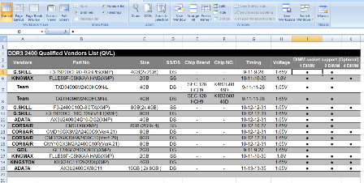
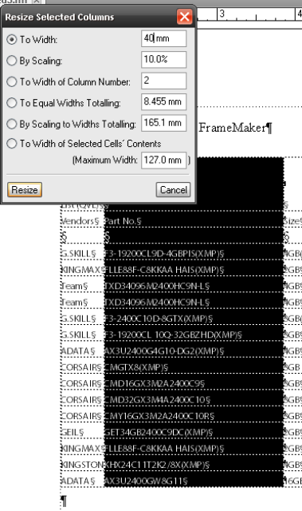
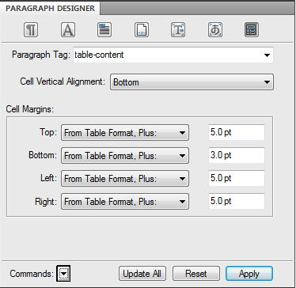

Importing and working with Excel tables in FrameMaker
=======================================================

.. contents:: Table of Contents
   :depth: 3

Despite improvements to table support in most applications, working with **Excel** tables in applications like **Adobe InDesign, FrameMaker** and **CorelDraw** is less than ideal, especially if you are working on a deadline. In **InDesign**, most writers would import the **Excel** file as text and convert the content to a table and format the table and contents manually in a time consuming process. Other methods would involve converting the table/chart to a vector object in **Adobe Illustrator** or **CorelDraw** to take advantage of the flexibility of vector objects in page layout applications. The fastest way to import an **Excel** table to a document is to save the **Excel** table as a bitmap or PDF and **Place/Import** the PDF into **FrameMaker** or **InDesign**. Unfortunately, this method has similar limitations to converting the table to a vector object - the table loses its text properties and common text tasks such as copy and paste are no longer available once the document is exported to PDF for editing, review, or publication.

**FrameMaker's** table handling has advantages over **Adobe InDesign's** WYSIWYG approach, but learning **Table Designer** and **FrameMaker's** different interface can be trying for new users. This series of articles will discuss one way to import and format Excel articles for use in **Adobe FrameMaker 10**.

Preparing the Excel table
-------------------------------

This example makes use of a **Microsoft Excel 2007** table with numbers, text, and columns of varying widths.

To facilitate importing to **FrameMaker**, remove all formatting and colors. To avoid symbol or font issues, the bullets in the last three columns were formatted using a generic font, as is the rest of the text.

A quick way to remove table formatting is to select all the table cells, copy, and paste the cells in a new workbook using the **Paste Special** command. Select only **Values** and then save the workbook.

.. image:: images/fm_table2.png

Preparing FrameMaker
-------------------------

Before starting work with tables in **FrameMaker**, change the display units of the ruler. **Since FrameMaker** isn't a WYSIWYG application, you will have to manually input values for the table column widths and rows.

To change the **Ruler** display units:

1. Click **View > Options**.

2. In the **Display Units** item, select your preferred unit of measurement.

3. In the **Rulers** item, select your preferred unit of measurement.

4. Click **Set**.

.. image:: images/fm_table3.png
    :align: center

When working with **Excel** tables, you would need both the **Paragraph Designer** and **Table Designer** tabs so you can open them before importing the **Excel** file.

Importing the plain Excel table
------------------------------------

To import the **Excel** table:

1. Place the insertion point to where you want the table to appear.

2. Click **File > Import**.

3. Click **File**, then select the **Excel 2007/2010** file.

4. Select **Copy Into Document > Import**.

.. note::

	If you select the **Import by Reference** option, you would have to click the **Convert** button in the **Text Inset Properties** tab.

5. **FrameMaker** will display the **Unknown File Type** window for **.xlsx** files. Select **Microsoft Excel 2007**, then click **Convert**.

.. image:: images/fm_table4.png

6. In the **Import Text Flow by Reference** window, select **Reformat as Plain Text > Import**.

The table will appear on your main **Body Flow** after the paragraph mark if your **Text Symbols** are visible. Note that most **Excel** tables are often wider than a typical A4 or Letter-size document in **FrameMaker**. The table will be cut off with parts of it not visible. In most cases, you would have to modify the content of the table in addition to resizing the columns and text sizes.

.. note::

	Unlike **InDesign**, where you can toggle between views to display non-printing or hidden parts of the work page, you cannot see the missing portions of the table outside the **FrameMaker** document window.

.. image:: images/fm_table5.png

Editing the Table of Contents, columns and text
----------------------------------------------------

To make the table fit the document window in **FrameMaker**, you would have to edit the text size, cell margins, and columns of the table. In this example, the table contains technical information that isn't as necessary for most readers so a compromise between text size and column size was needed. However, check with your technical editor before making any direct edits to the text.

To change text size and font using **Paragraph Designer**:

1. Place the insertion point inside the table. The text is automatically formatted using the default **Paragraph** tag if you followed the import steps described in the previous section.

2. Create a new paragraph tag in **Paragraph Designer**. Click **Commands > New Format > Create**.

3. Change the text size and font. For this example, a size value of 9.0 pts is used.

4. Select the text/table cells and click **Apply**.

You can select the non-visible portions of the table once they appear on the document window. You can also refine formatting of the text later for specific types of text. The objective at the moment is to "shrink" the table and allow the missing portion of the table to appear.

.. image:: images/fm_table6.png

Resizing the columns
--------------------------

If a significant portion of the table is still not visible, resize the columns to remove excess white space. You can shrink the column size tightly around the text or specify exact values for the columns.

Before starting, change the view so that the **Text Symbols** are not visible by clicking **View > Text Symbols**.

To maximise column space:

1. Place your mouse pointer inside a cell in the column you want to edit.

2. Click **Table** on the main toolbar, then **Format > Resize Columns**.

.. image:: images/fm_tableb1.png
    :align: center

3. In the **Resize Selected Columns** window, select **To width of Selected Cells' Contents**.

The column width will shrink tightly around the text. Note that you can modify the margins or the column size later.

To specify exact measurements of the column width:

1. Place your mouse pointer inside a cell in the column you want to edit.

2.  Click **Table > Format > Resize Columns**.

3. Specify a value in the **To Width:** item.

Refining the Cell Margins using Paragraph Designer
-------------------------------------------------------

If you used the **To width of Selected Cells' Contents** option in the **Resize Selected Columns** window, you might find the text too closely spaced from cell to cell. To quickly add "cell padding" to make text readable, use the **Paragraph Designer**.

To adjust **Cell Margins** using the **Paragraph Designer**:

1. Click the **Table Cell** button in **Paragraph Designer**. Select the **Paragraph** tag you used for the table text.

2. Input margin values in the **Cell Margin Top, Bottom, Left** and **Right** items.

3. Click **Apply** or **Update All**.

Once all the columns are of the correct size and text within the cells are allotted enough space, check if all the contents of the **Excel** table are now visible. You may need to do a bit of trial and error especially if the content length for each cell varies.

In the following screenshot, the first column's all caps text has been changed, the headings have been shortened, and the columns resized to extremely conservative values.

.. image:: images/fm_tableb4.png

Now that all the columns of the Excel table are visible, you can now format the color, table headings, table lines and shading and merge cells.
