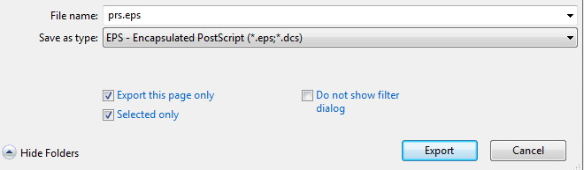
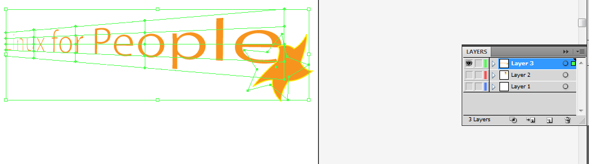

Adobe Illustrator and CorelDraw: Exporting selected objects
=================================================================

**CorelDraw** and **Adobe Illustrator** handle objects differently.  While Adobe Illustrator focuses on only industry-standard and Adobe-native formats, CorelDraw exports designs to a wide-variety of file formats.  The process is different for both applications.

Export Selected Objects to EPS in CorelDraw X5
------------------------------------------------------------

Exporting objects in CorelDraw to different formats is extremely straightforward.

1. Using the **Select Tool**, select all the objects intended to be included in the final image file.

2. Click **CTRL+G** to group the objects.  Alternately, click **Arrange > Group.**

3. Click **File > Export**.  In the **Export** settings, select a file format such as **EPS**.  Select the **Selected only** box, which automatically selects **Export this page only**.

4. Once exported, the EPS file will only include the objects selected in Step 1 and can be opened or imported in applications such as InDesign or Illustrator.

Export selected objects to EPS in Adobe Illustrator CS4
------------------------------------------------------------

**Adobe Illustrator CS4** does not have a specific option to export individual objects individually.  Users would either use the **Clipping Mask** feature or the initial artboard should be the exact same size as the final exported image.

However, an easier way to export a specific object in an Adobe Illustrator document is to use **Layers** and the **Visibility/Hide** feature.

1. Create a new Layer specifically for the objects to be exported.  Name or change the color of the Layer if needed.

2. Select the objects using the **Pick Tool**.  If needed, **Group** the objects.  Click **Object > Group (CTRL+G)**.

3. Click **Edit > Cut**.  Switch to the new layer then click **Edit > Paste**.  The objects are now on the new layer.

4. Using the **Layer** dock, hide the other layers by toggling the visibility.  The artboard should now only display the objects to be exported.

5. Click **File > Save as**.  Select EPS or SVG on the **Save as** type box.

6. The exported image can now be imported to other applications for use.
