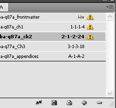
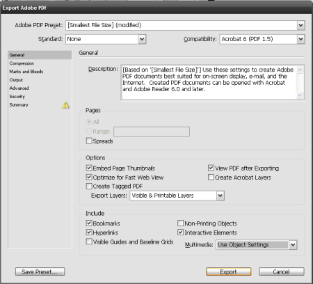
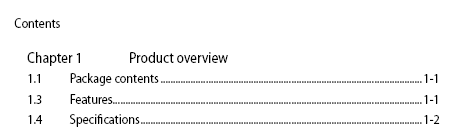
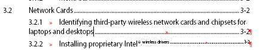
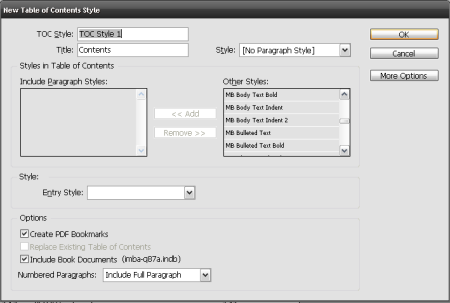

Troubleshooting Table of Contents in Adobe InDesign
=======================================================

**Adobe InDesign** is exceptional at page layouts but when it comes to even basic document organization, **FrameMaker**, **Microsoft Word 2010** or open source **LyX** handle table of contents more efficiently. If the PDF's bookmarks or table of contents hyperlinks aren't working, try checking the following:

1. If you created a **Book** in **InDesign** to organize your **.indd** files, make sure that each document is saved separately especially if you deleted or added pages. Save the **Book** then "refresh" your table of contents.

    The bang icon indicates an error in one of the Book entries.

.. topic:: Updating the table of content

    In **Adobe InDesign CS4**, click **Layout** then **Table of Contents**. If the **Update Table of Contents** option is not available, this means that major changes in pagination were made to your **Book** or **InDesign** document and you have to recreate the table of contents. If you don't recreate or refresh your table of contents, any PDF exported from your **Book** or **InDesign** file will not have working bookmarks or hyperlinks.

    .. image:: images/ind_toc2.png
        :align: center

2. When exporting an **InDesign** file or **Book** to PDF, select the **Bookmarks, Hyperlinks and Interactive Elements** options on the **General** window. Selecting the **Bookmarks** option instructs **InDesign** to create a list of bookmarks based on specified styles and the document's table of contents. Selecting the **Hyperlinks** option enables hyperlinks on the table of contents text itself.

3. If you've manually numbered the sections and chapters in your document, review the table of contents once it's created. Proofreaders and editors normally review the content and skip the front matter. Check the chapter and section numbers if they are sequentially correct. This is especially important if text is moved often and paragraph threads were left unbroken. The text frame may have moved but InDesign will still follow the original arrangement. Unlike **FrameMaker**, **InDesign** will not inform the writer of numbering errors.

4. Generated table of contents in **InDesign** are just plain text and are subject to errors too. Even if you accurately defined the paragraph styles of entries in the table of contents, formatting errors can occur especially when the text includes symbols or special formatting such as superscript.

   In the screen capture below, the registered trademark symbol's superscript formatting affected the preceding text and the leads, as well as the page number. Writers can safely select the text and remove the superscript formatting without affecting the functionality of the table of contents once exported to PDF.

5. Writers can shorten the text entry of the generated TOC entry (which is based on the section heading style) if it is too long and ruins the consistency of the table of contents (See ``3.2.1`` on the previous screen capture). Like tip #4 this does not affect TOC functionality in the resulting PDF.

6. If a new **InDesign** template doesn't have working PDF bookmarks and TOC, the most common cause is that the **Create PDF Bookmarks** option wasn't checked in the **Table of Contents Style** window.

7. If the **InDesign** document is very long and the table of content links in the PDF or bookmarks still don't work, consider creating a new Table of Contents Style. TOCs are heavily dependent on styles and starting with a fresh set of parameters will make sure a working TOC is produced.

8. Always check if your bookmarks and table of contents links are working after exporting to PDF.
