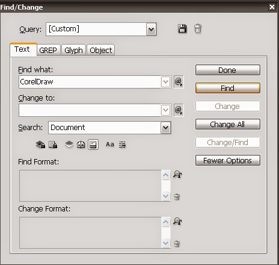
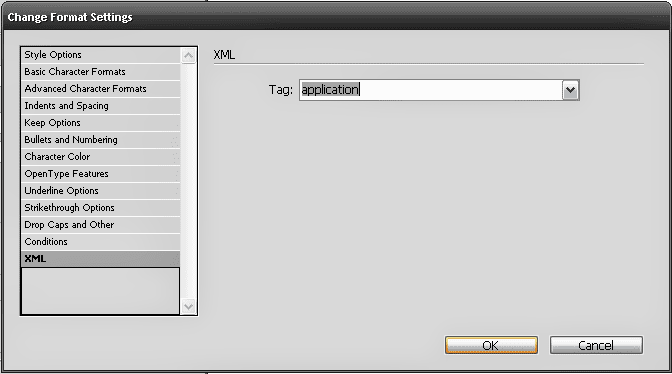
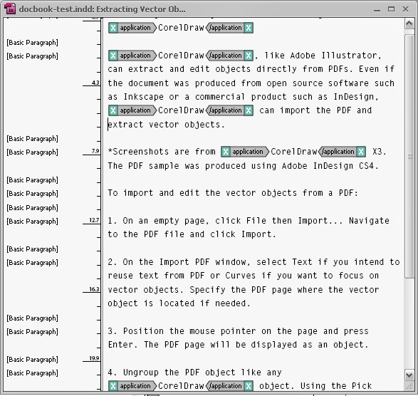

Adding XML tags using Find/Change in Indesign
=================================================

**Adobe InDesign** is not the best application for working with XML. It's an exceptional page layout program but most XML users would prefer either **FrameMaker** or open source tools when structuring long text. That said, if you ever need to add tags to an unstructured document, InDesign's **Find/Change** option can accomplish the task as with most XML editors.

Take note that the instructions below assume you've either loaded an XML file for a list of tags, created your own set of XML tags, or imported a DTD.

To add XML tags using Find/Change:

1. Click **View > Structure > Show Tag Markers**.
2. Click **Edit > Find/Change**.
3. In the **Find/Change** window, specify the text you want to tag in the **Find What:** box.

4. Click the icon in the **Change Format:** area for formatting options.
5. Select **XML** in the left panel. Select the tag in the list you want to assign. Click **OK**.

6. The format request will be added to the **Change Format:** list. Click **Change All**.

The specified text instances should now be marked with the XML tag. You can also view applied XML tags using **Structure View** or even using **Story Editor** by clicking inside a text frame and pressing **CTRL+Y**.
