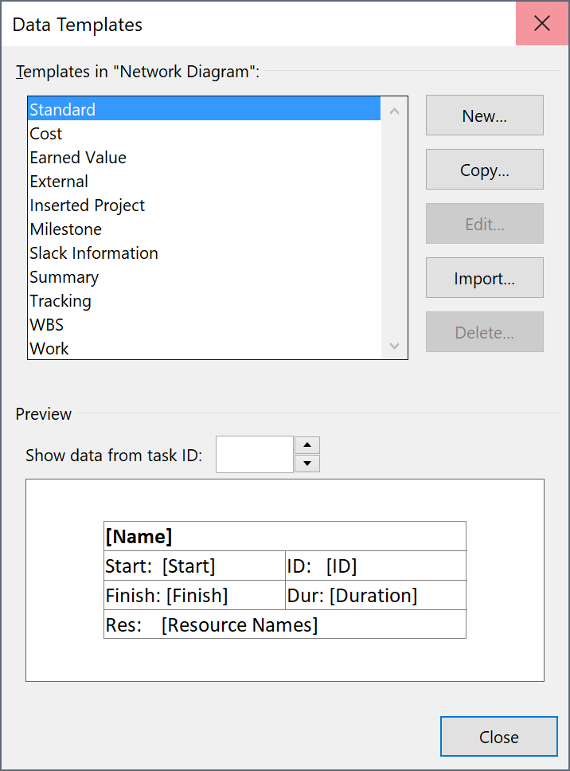
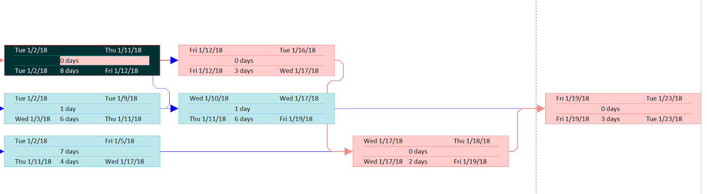

Microsoft 2016 Basics: PERT Diagram and Slack/Float
========================================================

If you're using **Microsoft Project 2016 Professional**, a network diagram is automatically set up for you once you enter **Task Names**, **Duration**, and **Predecessors** in the **Gantt Chart** view.

.. note::

	 MS Project uses the term *Slack*, not *Float*, which may confuse Project Management professionals, who are accustomed to the term *Float*, rather than *Slack*. In addition, Project uses the term *Predecessor* rather than *Dependencies*, another term often found in textbooks.

The default *Network Diagram* that MS Project Professional creates may not necessarily have the same appearance as PERT diagram examples taught in PMP, but the logic is the same and includes the duration and the task number (which is based on the sequence of tasks you list in the Gantt Chart). Moreover, you can edit the appearance of the **Network Diagram** to include any, or all details from the **Gantt Chart** view.

Viewing the PERT chart of a project
-------------------------------------

To view your Gantt chart's corresponding PERT diagram, click **View > Network Diagram**.

Even if you didn't select **Critical Tasks** from the **Format** ribbon in the **Gantt Chart** view, the **Critical Path** is highlighted in the Network Diagram as red.

Changing Work/Time duration scale
-----------------------------------

Although **MS Project** is used for large, complex projects, you can also use it to create simple Gantt diagrams for short-term tasks measured in hours and minutes. To do this, simply change the duration settings to **Minutes** or **Hours** before you begin creating a list of tasks.

To change duration input to minutes:

1. Click **File > Options > Schedule**.

2. Select **Minutes** for the setting **Duration is entered in** and **Work is entered in**.

3. Click **OK**.

.. note::

	 If you already have a task list with a specified duration, changing this setting won't revert the **Duration** values to minutes, so change the **Duration** setting before creating your tasks.

.. image:: images/project-timescale3.png

Displaying Slack in the Gantt Chart and PERT diagram
------------------------------------------------------

You can display the **Start/Finish/Total/Free Slack** in both the **Gantt Chart** and **PERT diagram**.

To display **Slack** information in **Gantt Chart** view:

1. Click **Task > Gantt Chart**.

2. Click **Add New Column**, and then type or select **Start Slack, Finish Slack, Total Slack,** or **Free Slack**.

To display **Slack** information in the **Network Diagram** view:

1. Right-click any of the boxes, and then click **Format Box**.

2. Click **More Templates > New**.

3. Type a ``Template Name``. In this example, *Slack Information* is used.

4. Click a cell from the **Choose cell** box, and then select values that you want to appear on your **Network Diagram** from the list.

In the following example, **Late Start, Late Finish, Early Start, Early Finish, Duration** and **Total Slack** are added to the cells.

5. Click **OK**. The new template is added to the list of the **Data Templates** box.

6. Click **Close**.

7. To apply the template, select the **Network Diagram** boxes. Right-click and then click **Format Box**.

8. Select the **Data Template** you created from the list, and then click **OK**.

Values on the **Network Diagram** boxes are updated. In the following example, **Late Start, Late Finish, Early Start, Early Finish, Duration** and **Total Slack** are added to the boxes.

