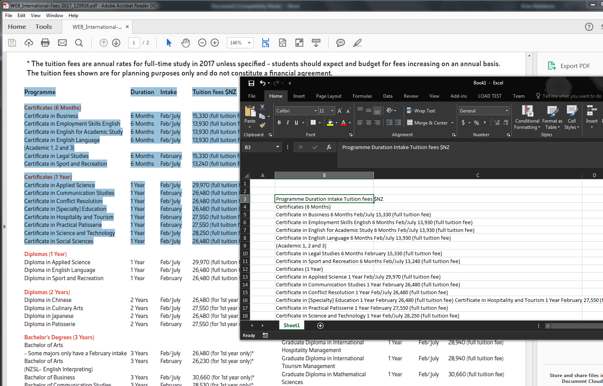
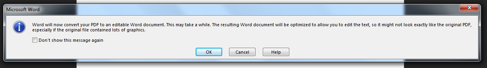
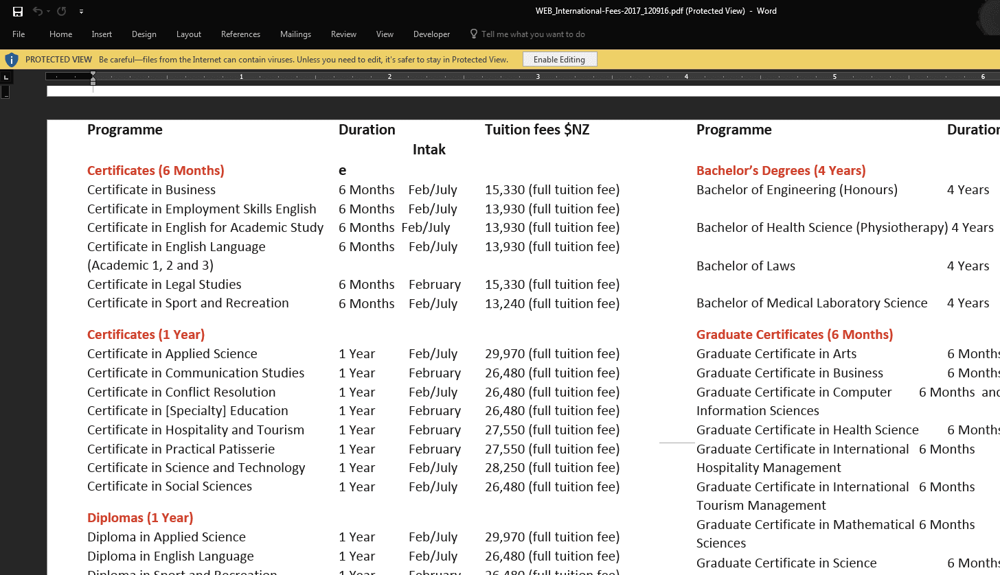
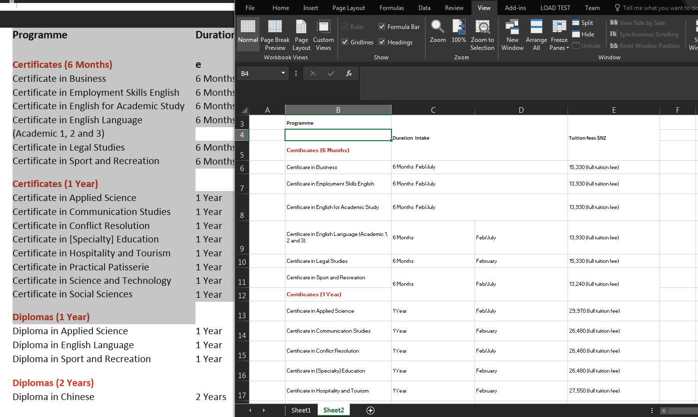

Importing tables from PDFs using Word 2016
=================================================

In some cases you can copy tables from a PDF and paste them directly to an Excel worksheet. On the other hand, depending on what application was used to publish the PDF, pasted table content from a PDF will lose the table structure.

.. note::

	You can check what application was used to produce a PDF by clicking **File > Properties > Description** in **Acrobat Reader DC**.

In the following example, a table of tuition fees is pasted from a PDF to a worksheet in **Excel 2016**. The PDF was created from **Adobe Indesign CS 2014 for Mac**. Although the text is present, the table structure and cells aren't maintained.

One quick and easy workaround for copying tables from a PDF is by opening the PDF in **Microsoft Word 2016** first and then copying the tables from there.

The PDF in the example, when opened in **Microsoft Word 2016**, doesn't completely display the PDF accurately but the table columns and rows are largely retained.

You can then copy and paste the tables to an Excel Worksheet. Although some merged columns are split, the tables are more accurate than copying and pasting from the PDF directly, and makes editing the content easier.

Note that this method doesn't always work and really depends on what application was used to produce the original PDF. Adobe and Corel products, however, produce fairly consistent tables when converting documents to PDF so shouldn't be a problem.
