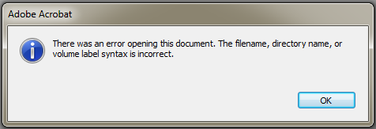

"Volume syntax error" when opening a PDF in Acrobat
==================================================================

If you work in a global environment, you may receive a PDF on your office Inbox and get an error from **Adobe Acrobat** or **Adobe Reader** indicating ``"There was an error opening this document. The filename, directory name, or volume label syntax is incorrect."`` when attempting to open the PDF.

Working in a global environment means that you will receive PDFs with different types of input and encoding. The PDF is not corrupted nor is it riddled with malware. Your PDF reader and system may just not be prepared to accept the encoding of the PDF, especially if your Windows machine was only configured for English (or International English).

To resolve this issue, download the PDF file to a folder and rename the file to something more intelligible in English. Add the **.pdf** extension if needed. This issue may occur with PDF files assigned with a name using Traditional Chinese, Arabic, Cyrillic, Japanese or other similar character sets. After renaming the file, Acrobat or your PDF reader should be able to open the file. If text are missing on the PDF then you may have to request for the PDF to be recreated with an embedded subset of fonts (or you will need to install a specific set for your system).
