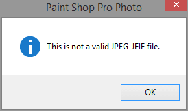
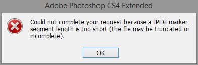

JPEG error when downloading photos using OneDrive (iOS7)
===========================================================

If you enabled the photo backup option in the **OneDrive** app for **iOS7**, photos are backed up automatically to your Microsoft cloud storage. However, you may encounter an error if you download the JPEG from **OneDrive** and attempt to open the file in a photo-editing application such as **Corel Paint Shop Pro** or **Adobe Photoshop**.

The error describes a ``Could not complete your request because a JPEG marker segment length is too short (the file may be truncated or incomplete)`` in **Adobe Photoshop CS4**. **Corel Paint Shop Pro**, on the other hand will display a ``This is not a valid JPEG-JFIF file. error``.

If you encounter this error, there are a few workarounds to this issue:

- Download the photo directly to your PC from your iOS7 device using a USB cable.

- E-mail the photo or use a different online storage service to download the photo from your iOS7's camera roll.

- From your iOS7 device, open the photo using any photo app such as **Adobe Photoshop Express** for iOS, do a minor edit (crop or **Auto Fix**) and save the photo. Once the edited image is uploaded to **OneDrive**, you should no longer have problems downloading and editing the photo in a dedicated image editor.

- If you've already downloaded the photo using **OneDrive** to your Windows computer, you will not be able to convert the JPEG to a different format using Photoshop or Paint Shop due to the error. However, you can open the file in **Microsoft Office Picture Manager** and export the file to PNG. After you save the JPEG to PNG, you should have no problems opening the file in a dedicated image editor.

.. note::

    **Microsoft Office Picture Manager** is included with older versions of **Microsoft Office**.
