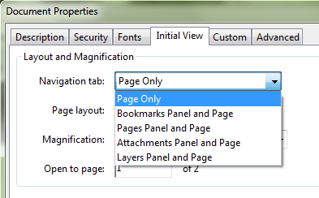
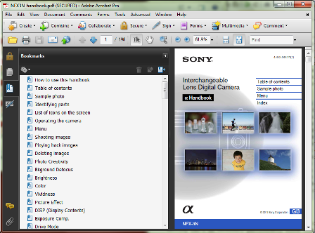
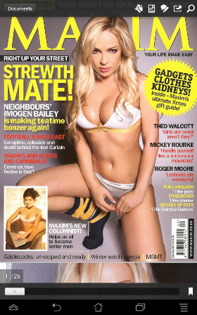
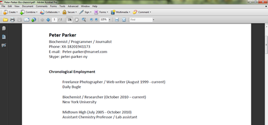
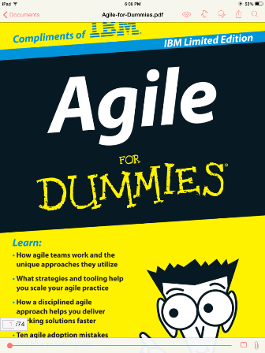

When to change the Initial View Setting in Adobe Acrobat
==========================================================

Users can generate PDFs from almost every application in Windows, MacOSX, Linux and even mobile OS apps from Android and iOS. However, one of the advantages of working in **Adobe Acrobat** is the ability to customize how a PDF is displayed when opening the document in **Adobe Reader**.

With the popularity of smaller form factors and PDF readers/apps that are not necessarily compliant to Adobe's PDF engine, it's understandable, however, that customizing PDF settings such as **Initial View** is often ineffective. The Adobe Reader app for Android, for example, will not necessarily follow the Initial View setting due to app and display constraints.

It does, however, make sense to setup **Initial View** if the PDF is for professional publishing and distributed in an enterprise environment which uses Adobe products, particularly an updated version of Adobe Reader. The **Initial View** option is a simple and easy way to impress or provide an impact to readers when providing a professional document such as an official report, curriculum vitae, manuscript or official documentation.

In **Adobe Acrobat Pro 9** and later versions, you can customize the **Initial View** by opening the PDF and clicking **File** then **Properties** or by clicking **CTRL+D**. On the **Initial View** tab you can change the **Layout and Magnification**, **Window**, and **User Interface** options.

Navigation tab, Page Layout, and Magnification
------------------------------------------------

The **Navigation** tab lets you customize if the **Pages, Layers,** and **Bookmarks** panel are displayed (in later versions of Acrobat more panels can be displayed on opening the PDF). If your document or book, for example, has a long table of contents you would probably want to select the **Bookmarks Panel and Page** option. This is especially important for long user guides, short story anthologies, dissertations, manuals, and technical documents. For a 2-3 page resume or curriculum vitae, you would probably just select Page - this prevents the HR recruiter from being distracted by any unnecessary panels.

    The Sony NEX manual uses the Bookmarks Panel and Page option as Initial View.

The **Page Layout** setting is for navigation. If your reader or audience will be opening the PDF on a netbook or ultraportable with limited screen real estate, you might want to select **Single Page Continuous** which lets readers scroll down all throughout the document. In contrast, a **Single Page** view displays a PDF page one at a time, which is probably a good idea if you want the reader not to skip the 1st page (as with a resume or letter). In general, **Two-Up** views are only used if you're providing an image intensive PDF with spreads such as a magazine, art portfolio, or graphic novel. The reading settings are available in the WP8, iOS, Android and desktop Adobe Reader apps so this option can be ignored. If you're a graphic designer, check the technical style guide or ask your technical editor if changing the **Page Layout** is required.

    Adobe Reader for Android has options to change how a PDF is read.

The **Magnification** setting in the **Initial View** tab is used to adjust how much of the first PDF page is displayed when the PDF is opened. This setting is fairly inconsequential if the reader will be using a large screen which supports high-resolution images (such as the Macbook's Retina display). The **Default** option's effect on the PDF varies on tablets and thin-and-light 14" and higher resolution notebook displays. For professional documents, changing the setting can provide a suitable visual impact to your reader or focus on a specific area of your PDF. If it's a formal letter or resume, you might want to set it to just Fit Width so that the heading (your name or company name) attracts focus.

    A resume produced in Microsoft Word with Initial View setting at Fit Width.

If your document or PDF magazine has a striking cover, you might want to select **Fit Page** so the whole illustration or photograph is visible when opened in Adobe Reader. On the other hand, maybe you would avoid using **Fit Page** or **Actual Size** for a resume simply because it will make your resume unreadable once it is opened and your audience will have to zoom in to read the text.

    A PDF in Adobe Reader for iOS7.

Window Options and User Interface options
-------------------------------------------

In today's world of tablets and hybrid machines, the **Window Options** setting isn't as necessary particularly since today's display resolutions are so high even on smaller devices such as smartphones and tablets. If you're producing your PDF in an enterprise environment where notebook size and desktops are standardized, however, you can change options.

Finally, the **User Interface** options hide Adobe Reader's window and application bars. In most cases, this creates a pretty jarring effect on a reader, somewhat like opening a PowerPoint presentation that automatically runs the first slide. Most users would prefer to skim through a PDF document first with access to menu and tool bars rather than be forced to press **ESC**.
