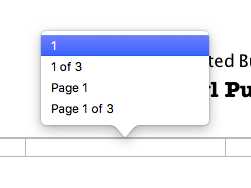

Sections and Front Matter in Pages for MacOS
================================================

Apple recently released an updated version of Pages for **macOS**. The word processor has been lost in the flood of free and paid writing apps for **iOS** and **macOS**, but **Pages** is actually perfect for producing ebooks and PDF. **Pages**, unlike **Microsoft Word** and **LibreOffice Writer**,  supports exporting to **ePUB** and can be used hand-in-hand with **iBooks Author**.

Even though ebook pages technically aren’t identified as recto and verso, writers and publishers still have to consider how to separate Front Matter and the main body of text. This can be accomplished by creating *Sections*, which is added slightly differently in **Pages** when compared with **Word, LibreOffice Writer,** and **Corel WordPerfect**.

This article uses **Pages 6.1** on a MacBook Air running macOS 10.12.4. The exported PDF was tested using Adobe Acrobat Reader DC and iBooks.

This article provides an overview of setting up the **Title Page** and **Copyright Page**, and adding sections to separate the **Front Matter** from the main text body.

Setting up the Title Page, Copyright Page, and Dedication Page
--------------------------------------------------------------------

To set up the **Title Page, Copyright Page,** and **Dedication Page**:

1. Display the page guides and rulers.

  - Click **View > Show Ruler**.

  - Click **View > Show Layout**.

2. Add required title page text as needed.

3. If you need to position text in Pages, insert a **Text box**.

   Click **Text** on the control bar and adjust the position of the box in the page using the resize handles.

4. Click **Insert > Page Break** for the **Copyright Page**.

   Once you’re done with the **Copyright Page**, insert another **Page Break** if needed.

.. tip::

	 To insert the Copyright symbol, click **Edit > Emoji & Symbols**.

5. To add the dedication text, click **Text** on the control bar. The text box appears on the center of the page.

   Insert another page break after adding the text for dedication.

6. Click any of the header or footer areas. Click **Insert Page Number**, and then select the suggested page format.

Inserting a Section Break and changing Page Number format.
-------------------------------------------------------------

Up to this point, there are now four pages (**Title, Copyright, Dedication,** and a blank page) for the **Front Matter**. Sections are required to separate page numbers formatted as Roman numerals for the **Front Matter**, and Arabic numeral page numbers for the rest of the book.

To create a Section for different page numbering formats:

1. At the insertion point of the blank page, click **Document > Section**.

2. On the **Create a new section** list, click **After this section**.

   .. image:: images/ubo_2020.png

4. Clear the **Match previous section** box.

   .. note::

	    This ensures that the page number format for pages after the **Front Matter** retains Arabic numerals. If you don't clear this box, changes to the page format will affect the **Front Matter** and the rest of the book.

5. Click any of the **Front Matter** pages, which is now the first section of the document, and then change the format to lowercase Roman numerals.

   Click **Document > Section > Page Numbering Format > i, ii, iii**.

   .. note::

   	  The Front Matter pages constitute the first section at this point. If you forget which pages are on a particular section, click **View > Show Thumbnails**. A yellow border appears on pages sharing the same Section.

      .. image:: images/ubo_2021.png

6. Select the box for **Hide on first page** of section to remove the visible Roman numeral on the Title Page.
