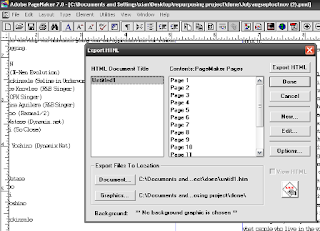
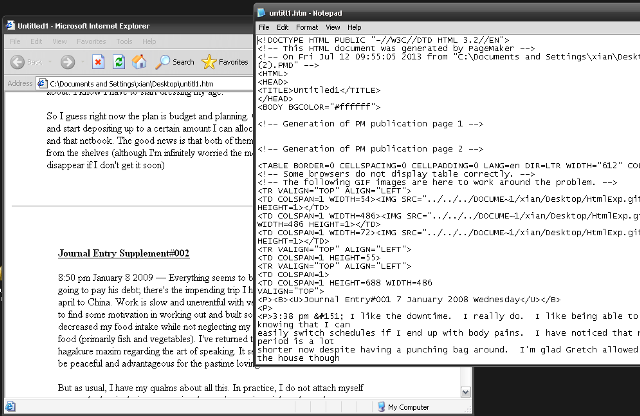

Repurposing PageMaker 6.5/7.x files: Export to HTML
======================================================

Adobe products are as expensive as ever, particularly with Adobe's controversial new subscription pricing scheme being launched this year. To repurpose or reuse content from old **.pmd PageMaker 7** or **PageMaker 6.5** files, export the book or document as HTML.

PageMaker exports **.pmd** files to a fairly clean though older version of HTML markup. Once exported to HTML, reusing the text and moving images are much easier. There are many open source applications that can work and convert old markup of HTML to HTML5 or XML. In addition, there are many editors such as **Bluefish**, **LyX** and **XML Copy Editor** that can facilitate transition to XML, Docbook and even EPUB.

.. note::

  Exporting to PDF using PageMaker is also a good option, though extracting the data is a bit more work than with HTML.

