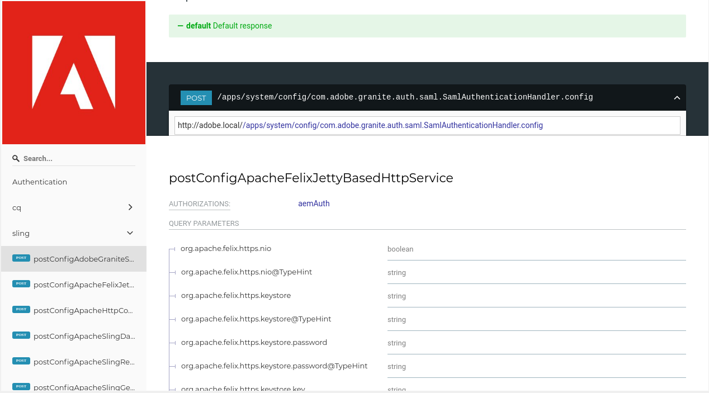

Using ReDoc for creating HTML OpenAPI documentation
========================================================

`ReDoc <https://github.com/Rebilly/ReDoc>`_ is used for formatting and rendering hosted **OpenAPI** files as **HTML** output. Users have the option to customize or add content to the **HTML** output as needed. **ReDoc** can be deployed on **GitHub**, as a **React** component, or via **Docker** and supports well-formed and **Swagger**-compliant **.json** and **.yaml** files.

.. image:: images/redoc_1.png

This article uses the following local environment and dependencies:

- Fedora 29 Workstation
- node.js 12.3.1
- npm 6.9.0
- ReDoc 2.x

Setting up ReDoc
------------------

To set up **ReDoc** using ``npm``:

1. Install dependencies as needed.

::

 npm i react react-dom mobx@^4.2.0 styled-components

2. Install the ``redoc`` package.

::

 npm install redoc --save

Creating a formatted page from an OpenAPI URL
-----------------------------------------------

1. Create an HTML page with the necessary formatting to allow for an adaptive design.

This example uses the following markup in the ``<head>`` tags.

::

 <meta charset="utf-8"/>
 <meta name="viewport" content="width=device-width, initial-scale=1">
 <link href="https://fonts.googleapis.com/css?family=Montserrat:300,400,700|Roboto:300,400,700" rel="stylesheet">
    

2. Add the source URL for the **OpenAPI** specification using the ``<redoc>`` tag in the body of the HTML file.

::

 <redoc spec-url='path of OpenAPI specification'></redoc>

3. Add the **ReDoc** script for rendering the page.

::

 

4. Open the web page to check the layout.

