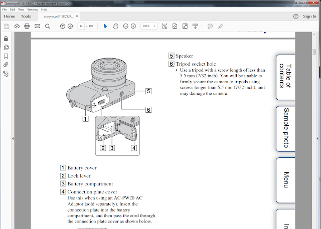
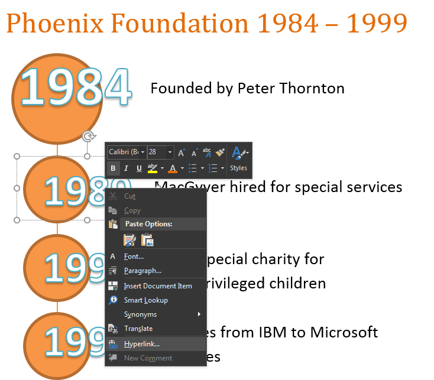

Creating navigation notebook tabs for PDFs from Word
=======================================================

Although it's somewhat redundant to add "hotspots" in **PDFs**, some technical writers use visual navigation aides in their publications because it's attractive and is easier to use on tablets and 2-in-1 laptops than text hyperlinks where you have to zoom in.

You don't need **Microsoft Publisher, InDesign,** or **CorelDraw** to produce PDFs with visual navigation cues. **Microsoft Word** has long had the ability to add these fairly basic components to your Word document and retain them once they are exported to PDF.

.. note::

	Image hotspots and interactive links in PDFs have been around as long as HTML 1.x. As noted, they can be useful for PDFs if the document is delivered and consumed via touch screen devices. For my part, I still prefer ordinary text hyperlinks, but I understand the resurgence of its use considering that today's generation of users think everything on a screen is designed to be tapped by a finger.

This article uses **Microsoft Word 2016** to produce a document with classic "notebook tabs" (similar to the *Sony NEX* manual shown previously) that supplement the **Bookmarks** and the **Table of Contents** of the final output PDF.

To create a PDF with clickable notebook tabs:

1. For the purpose of this article, a page border is added to assist layout. The page border will be visible in the final PDF output.

   Click **Design > Page Borders** to add a page border.

2. Adjust the margins of the document.

   Since this example has the notebook tabs on the right, the **Right Margin** was adjusted to 0.17" which is the smallest margin a standard Word document will support.

   Click **Layouts > margins > Custom Margins** to adjust the margin values.

   .. note::

   	  You can certainly force Word to have a smaller margin but this may push the objects and text outside the page borders in the resulting PDF.

3. Add the notebook tabs.

   - Click **Insert > Shapes** to add shapes to the document. Click the handles to rotate them in the proper direction.

   For this article, the shapes that will be used as notebook tabs are aligned to the page border.

   - To duplicate a shape, select the shape, and then click **CTRL+D**.

   - To align the shapes, select the shapes, and then click **Layout > Align > Distribute Vertically** and if needed, **Align > Align Right**.

   .. image:: images/ubo_137.png
      :align: center

3. Create a **Paragraph** style which allows for space between the text and the notebook tabs.

   For this example, the **Normal** paragraph style's right **Ruler marker** was dragged to 6.5. With the ruler marker on 6.5, the text won't overlap with the added shapes.

   .. image:: images/ubo_138.png

4. Add and format the text inside the notebook tabs. If needed, use large text sizes to ensure that the tabs can be tapped in the output PDF when viewed on a tablet or 2-in-1 PC.

   For this example, *Start, Middle,* and *End* were added inside the notebook tabs.

5. Add the hyperlinks to the text inside the notebook tabs.

   Select and right-click the text.  Click **Hyperlink > Place** in this Document. For this example, there are **Heading 1** text for *Start, Middle,* and *End* in the document.

   .. image:: images/ubo_140.png

   If needed, change the format of the links. Once exported to PDF, the final appearance of the links on the Word document appears on the PDF as well.

.. tip::

	Try not to test the links in Word since the colors will change and the changed color will appear on the output PDF.

  .. image:: images/ubo_141.png

6. If needed, select the notebook tabs and then paste them on other pages of the document.

   You can group the notebook tabs by selecting the shapes and click **Group** on the **Drawing Tools > Format** tab.

7. Export the document as PDF. Click **File > Create PDF/XPS**.

   If you want the notebook tabs to be the primary navigation method on the PDF, click **Options** and clear the **Create bookmarks using Headings** checkbox. This prevents Word from creating a navigation bookmark tree for the PDF.

8. Open the PDF in a PDF viewer such as **Adobe Acrobat** and test the hyperlinks to the different parts of the document.

   The notebook tab links created in Word in this article were tested to work with **Xodo PDF Reader for Android** and Adobe Reader for **Windows 7/10, Android,** and **Windows 10 Mobile**.

Timelines
------------

You can use the text hyperlink as a visual navigation on PDFs in a variety of designs, such as in timelines. The same principles apply. By adding shapes and making sure they don't intrude in the text, you can creatively employ the document links to navigate through a long PDF.

In the following example, a company timeline illustration has areas that open to a different page describing the event for a particular year. Note that the text art inside the spheres are large enough so readers can easily tap on them on 5"-14" tablets, smartphones, and 2-in-1 PCs like the **Lenovo Yoga** and **Surface Pro 4**.

