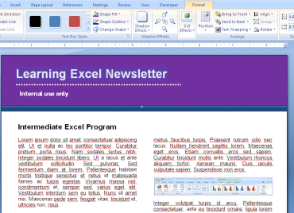
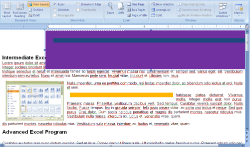

Web Layout view in Microsoft Office
======================================

The templates offered using **Microsoft Office** online are pretty good whether the templates were submitted by the Office community or from Microsoft Online directly .  However, be careful about using any template as body for an e-mail, say for an office e-mail newsletter.  Although professionally-designed, some of them were meant for print only and not for the web.  Documents sent as e-mail are reformatted in HTML and if the designer made use of objects and columns rather than tables and HTML, then the layout would display horrendously in an e-mail client or web page.  The best way to check if it's for web consumption (or e-mail consumption) is to click on **View > Web Layout** first before working on the Template.  It will save a lot of time and effort.

The following template looks good in **Print** view.

The objects and images are all over the place in **Web Layout** view for the same template.

